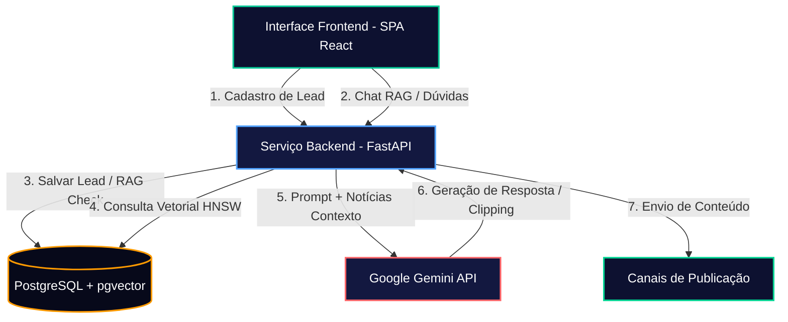
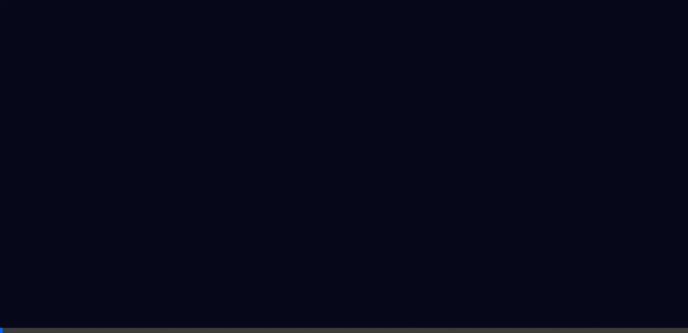
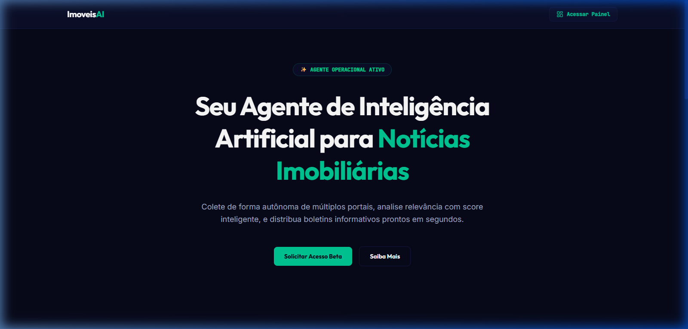
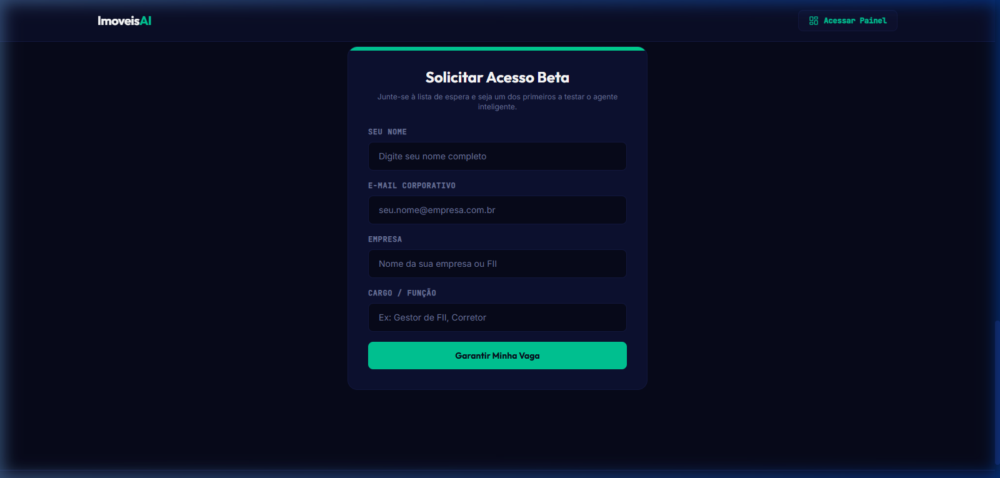
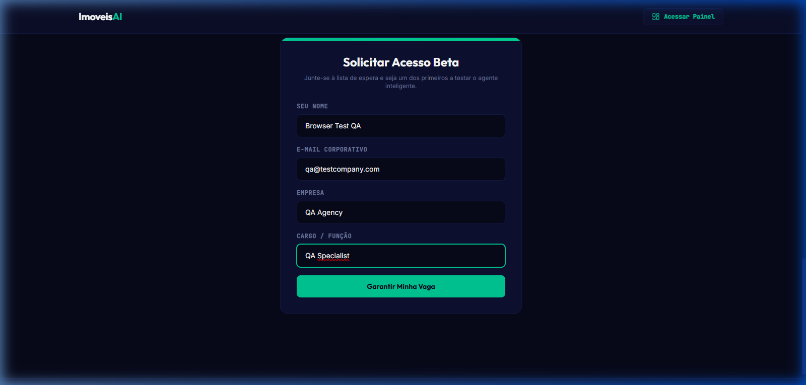
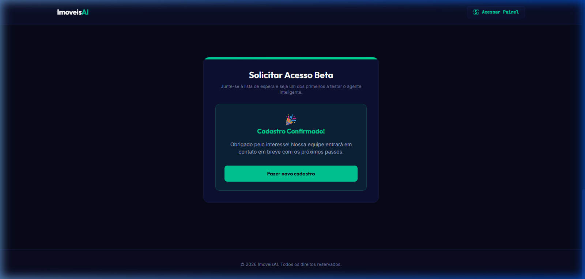

# 🤖 ImoveisAI - Agente de Notícias Imobiliárias com RAG e Captura de Leads

O **ImoveisAI** é uma solução inteligente desenvolvida para monitorar, consolidar, analisar e distribuir notícias do mercado imobiliário brasileiro. Com uma arquitetura moderna baseada em agentes inteligentes de IA, busca semântica em tempo real (RAG) e publicação automatizada em múltiplos canais, o sistema também oferece um fluxo otimizado de captura de leads qualificados.

---

## 🏛️ Arquitetura da Solução e Fluxo de Dados

A arquitetura do **ImoveisAI** foi desenhada para operar de forma descentralizada e resiliente, integrando interfaces modernas, APIs de alto desempenho, banco de dados vetorial e serviços cognitivos.



### 🎬 Demonstração Visual & Execução

Abaixo estão apresentados o fluxo de validação end-to-end e a interface visual do sistema, gravados durante a simulação de interação do usuário final (cadastro de lead e fluxo de conversação):

#### Fluxo de Execução e Cadastro
<p align="center">
  
</p>

#### Etapas da Interface (Captura de Tela)

````carousel

<!-- slide -->

<!-- slide -->

<!-- slide -->

````

#### 🎨 Protótipo Interativo & Design System (Figma)

Para exploração interativa das telas, componentes em Dark Mode e fluxo de experiência do usuário (UX) direto no navegador:

* 🎨 **Figma Community:** [Acessar Protótipo Interativo ImoveisAI no Figma](https://www.figma.com/community/file/1672672738080036230)
* 📐 **Especificações Técnicas:** Consulte o arquivo [`DESIGN.md`](DESIGN.md) para tokens visuais, paleta de cores e tipografia.

### Papel de Cada Camada no Ecossistema
*   **SPA Frontend (React 18 + Vite):** Interface responsiva, futurista em Dark Mode, dividida em quatro visualizações (Feed de Notícias, Fontes, Destinos e Configurações), integrada a um chat de IA interativo.
*   **Backend API (FastAPI):** Orquestrador de requisições, responsável pelo recebimento de leads, validação via Pydantic v2 e comunicação declarativa com o banco de dados.
*   **PostgreSQL + pgvector:** Armazenamento relacional e vetorial. Utiliza índices HNSW para realizar buscas por similaridade de cosseno com baixo custo computacional.
*   **Google Gemini API:** Utilizado tanto para a geração de embeddings de texto (`gemini-embedding-001`) quanto para síntese cognitiva e conversação (`gemini-2.5-flash`).

---

## 🛠️ Stack Tecnológica & Governança Agêntica

| Categoria | Tecnologia / Ferramenta | Utilização / Função no Sistema |
| :--- | :--- | :--- |
| **Frontend** | React 18, Vite, Tailwind CSS, Lucide React | SPA responsiva de alta performance e fidelidade visual. |
| **Backend** | Python 3.11+, FastAPI, Pydantic v2 | API Restful leve, tipada e rápida. |
| **IA / Embeddings**| Google GenAI SDK (`gemini-2.5-flash`, `gemini-embedding-001`) | LLM para respostas de chat inteligentes e geração de vetores. |
| **Banco de Dados** | PostgreSQL 15+, pgvector | Armazenamento persistente e indexação vetorial com HNSW. |
| **DevOps / Infra** | Docker, Docker Compose | Containerização simplificada para execução de microsserviços. |
| **Segurança** | python-dotenv | Separação estrita de segredos e credenciais locais do código. |

---

## 📁 Estrutura do Diretório

```text
agente-ia-para-noticias-imobiliarias/
├── .agents/                 # Customizações e regras locais do assistente de desenvolvimento
├── .antigravity/            # Configurações do ambiente de orquestração local
├── .specify/                # Especificações e contratos Figma-to-Code de design tokens
├── backend/                 # Código do servidor FastAPI
│   ├── .env.example         # Exemplo de variáveis de ambiente do backend
│   ├── init_db.py           # Script de migração e criação das tabelas e índices vetoriais
│   ├── main.py              # Pontos de entrada da API e mocks de visualização do dashboard
│   └── requirements.txt     # Dependências Python (FastAPI, psycopg2, google-genai)
├── docs/
│   └── assets/              # Demonstrações visuais, gifs, diagramas e mídias de validação
├── frontend/                # Aplicação cliente React
│   ├── src/                 # Componentes React de visualização (Hero, Stats, Form, Admin)
│   ├── package.json         # Manifesto de dependências npm e scripts de execução
│   └── vite.config.js       # Configurações do Vite e Tailwind CSS
├── docker-compose.yml       # Orquestração local do banco com pgvector
├── tools.yaml               # Configuração declarativa de fontes, modelos e ferramentas RAG
├── DESIGN.md                # Diretrizes visuais, paleta de cores e tipografia oficial
└── README.md                # Esta documentação principal
```

---

## ⚙️ Variáveis de Ambiente e Configuração (Sanitizadas)

Para executar o sistema, configure as seguintes variáveis no arquivo `.env` na raiz do projeto ou no diretório `backend/`:

| Variável | Tipo / Formato | Descrição | Exemplo Seguro |
| :--- | :--- | :--- | :--- |
| `DB_HOST` | String | Host do banco de dados PostgreSQL | `localhost` |
| `DB_PORT` | Inteiro | Porta exposta da instância Postgres | `5432` |
| `DB_NAME` | String | Nome do banco de dados da aplicação | `imoveisai` |
| `DB_USER` | String | Usuário de acesso ao banco | `postgres` |
| `DB_PASSWORD` | String | Senha de acesso ao banco | `sua_senha_segura` |
| `GEMINI_API_KEY`| String | Chave de acesso à API do Google Gemini | `AIzaSyD-ExemploChaveGemini1234` |

---

## 🚀 Como Executar Localmente

> 🎨 **Prefere inspecionar o visual sem executar código?** Você pode navegar no [Protótipo Interativo no Figma Community](https://www.figma.com/community/file/1672672738080036230).

### Pré-requisitos
*   **Docker & Docker Compose** instalados.
*   **Python 3.11+** instalado.
*   **Node.js 18+** instalado.

### Passo 1: Inicializar o Banco de Dados (PostgreSQL + pgvector)
Na raiz do workspace, inicialize o container de banco de dados:
```bash
docker-compose up -d
```

### Passo 2: Configurar e Executar o Backend
1. Navegue até o diretório `backend/` e instale as dependências:
   ```bash
   cd backend
   python -m venv .venv
   # No Windows:
   .venv\Scripts\activate
   # No Linux/macOS:
   source .venv/bin/activate
   
   pip install -r requirements.txt
   ```
2. Crie o arquivo `.env` (com base no `.env.example`) e configure a sua `GEMINI_API_KEY`.
3. Execute o script de inicialização para habilitar a extensão vetorial e criar as tabelas:
   ```bash
   python init_db.py
   ```
4. Inicie o servidor FastAPI:
   ```bash
   uvicorn main:app --reload --port 8000
   ```

### Passo 3: Configurar e Executar o Frontend
1. Abra um novo terminal, navegue até a pasta `frontend/` e instale as dependências:
   ```bash
   cd frontend
   npm install
   ```
2. Inicialize o servidor de desenvolvimento Vite:
   ```bash
   npm run dev
   ```
3. Acesse a aplicação no navegador em `http://localhost:5173`.

---

## ☁️ Instruções de Build e Deploy (GCP)

Para preparar o deploy do backend para produção no **Google Cloud Run**, você pode utilizar os seguintes comandos baseados na gcloud CLI:

### 1. Criar o Dockerfile no Backend
Crie um arquivo `backend/Dockerfile` contendo:
```dockerfile
FROM python:3.11-slim

WORKDIR /app

COPY requirements.txt .
RUN pip install --no-cache-dir -r requirements.txt

COPY . .

CMD ["uvicorn", "main:app", "--host", "0.0.0.0", "--port", "8080"]
```

### 2. Build e Push para o Google Artifact Registry
```bash
# Definir variáveis de ambiente temporárias
export PROJECT_ID="seu-projeto-gcp"
export REGION="us-central1"
export REPO_NAME="imoveisai"

# Construir imagem e publicar
gcloud builds submit --tag gcr.io/$PROJECT_ID/$REPO_NAME-backend:latest ./backend
```

### 3. Deploy para o Cloud Run
```bash
gcloud run deploy $REPO_NAME-backend \
    --image gcr.io/$PROJECT_ID/$REPO_NAME-backend:latest \
    --platform managed \
    --region $REGION \
    --allow-unauthenticated \
    --set-env-vars DB_HOST="sua-url-cloud-sql",DB_USER="postgres",DB_NAME="imoveisai"
```

---

## 💡 Sugestões de Evolução e Próximos Passos (Recomendações do Arquiteto)

1.  **Segurança em Produção:** Remover fallbacks padrão para credenciais locais existentes em `get_db_connection()`. Certifique-se de que a API lance um erro descritivo em vez de retroceder para usuários padrão como `"postgres"` se as variáveis de ambiente não estiverem configuradas.
2.  **Gerenciamento de Segredos:** Integrar a injeção do `GEMINI_API_KEY` e senhas de banco através do **Google Cloud Secret Manager** no ambiente Cloud Run em vez de variáveis de ambiente em texto plano.
3.  **Melhoria de FinOps:** Implementar cache com Redis ou similar na busca semântica RAG para evitar requisições redundantes de embeddings ao modelo `gemini-embedding-001`, economizando o consumo de tokens em queries de dúvidas frequentes.
4.  **Habilitação de Testes Automatizados:** Adicionar suíte de testes de integração com `pytest` para simular requisições HTTP na rota de captura de leads (`POST /api/v1/lead`) interagindo diretamente com o container `pgvector` em pipelines de CI/CD.
