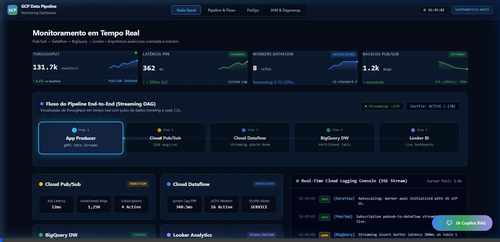

# Observabilidade Agêntica, FinOps & Governança IAM em Pipelines de Dados GCP



> **Plataforma Enterprise de Observabilidade em Tempo Real, Análise Causa-Raiz Agêntica (Google ADK / Gemini 2.0 Flash) e Otimização de Custos (FinOps) para Data Pipelines Streaming no Google Cloud Platform.**

[](https://www.figma.com/community/file/1685391125984310509)
🎨 **[Acessar Protótipo Interativo no Figma Community](https://www.figma.com/community/file/1685391125984310509)**

---

## 📌 1. Visão Geral do Projeto

Este projeto consiste em um ecossistema completo de **Observabilidade Agêntica, FinOps e Auditoria de Segurança IAM Zero-Trust** projetado para monitorar pipelines de dados streaming de alta vazão no **Google Cloud Platform (GCP)** (arquitetura baseada em **Cloud Pub/Sub ➔ Cloud Dataflow ➔ BigQuery ➔ Looker BI**).

### 🎯 Objetivos de Negócio e Engenharia:
- **Telemetria de Alta Frequência:** Monitoramento em tempo real de latência P99, vazão de eventos (130k+ events/s), backlog de mensagens no Pub/Sub e auto-scaling de vCPUs no Dataflow via Server-Sent Events (SSE).
- **Análise Causa-Raiz Agêntica:** Copiloto de governança de IA baseado em **Google ADK (Agent Development Kit) e Supervisor Architecture (Gemini 2.0 Flash / 1.5 Pro)** que correlaciona picos de backlog, gargalos de escrita e limites de infraestrutura emitindo planos de remediação acionáveis com streaming de pensamento token-a-token.
- **Engenharia de FinOps & Otimização de Custos:** Identificação contínua de ineficiências em jobs do Dataflow (uso do Shuffle Service) e queries no BigQuery (particionamento por data e clustering), projetando economias superiores a **34% a 68%** nos custos operacionais diários.
- **Auditoria de Segurança Zero-Trust & IAM:** Matriz de conformidade alinhada a baselines organizacionais GCP, validando permissões de Service Accounts, VPC Service Controls, Customer-Managed Encryption Keys (CMEK) e políticas de localização geográfica.

---

## 🏛️ 2. Arquitetura da Solução e Fluxo de Dados

### 📐 Diagrama Técnico da Arquitetura (Mermaid)

```mermaid
flowchart TD
    subgraph Frontend["💻 Frontend Layer (React 18 / Vite / Tailwind)"]
        UI["Dashboard Single Page App"]
        OverviewTab["Aba 1: Visão Geral Telemetria"]
        PipelineTab["Aba 2: Diagrama & Specs DAG"]
        FinOpsTab["Aba 3: FinOps & Custos"]
        SecurityTab["Aba 4: IAM & Zero-Trust"]
        AgentModal["Copiloto IA (RAG & Governance)"]
    end

    subgraph API_Gateway["⚡ Backend Gateway (FastAPI / Uvicorn)"]
        Router["FastAPI APIRouter"]
        MetricsSSE["/api/v1/metrics/stream (SSE)"]
        LogsSSE["/api/v1/logs/stream (SSE)"]
        FinOpsAPI["/api/v1/finops/costs (REST)"]
        SecurityAPI["/api/v1/security/iam-bindings (REST)"]
        AgentsAPI["/api/v1/agents/execute (SSE Stream)"]
    end

    subgraph Agentic_Layer["🤖 Governança Agêntica (Google ADK / LangGraph)"]
        Supervisor["Pipeline Supervisor Agent (Gemini 2.0 Flash)"]
        AnomalyAgent["Anomaly Correlator Agent (Gemini 1.5 Pro)"]
        FinOpsAgent["FinOps Optimizer Agent"]
        IAMAgent["IAM Audit Agent"]
    end

    subgraph Cloud_Infrastructure["☁️ GCP Data Pipeline & Telemetria"]
        PubSub["Cloud Pub/Sub (Ingestão High-Throughput)"]
        Dataflow["Cloud Dataflow (Apache Beam Stream Processing)"]
        BigQuery["BigQuery Data Warehouse (Partitioned & Clustered)"]
        CloudMonitoring["Cloud Monitoring & Cloud Logging"]
        IAMBaseline["IAM Policies & Org Constraints"]
    end

    %% Conexões Frontend -> Gateway
    UI --> OverviewTab & PipelineTab & FinOpsTab & SecurityTab & AgentModal
    OverviewTab -->|EventSource SSE| MetricsSSE
    OverviewTab -->|EventSource SSE| LogsSSE
    FinOpsTab -->|Fetch REST| FinOpsAPI
    SecurityTab -->|Fetch REST| SecurityAPI
    AgentModal -->|POST SSE Stream| AgentsAPI

    %% Conexões Gateway -> Agentes e Infra
    Router --> MetricsSSE & LogsSSE & FinOpsAPI & SecurityAPI & AgentsAPI
    AgentsAPI --> Supervisor
    Supervisor --> AnomalyAgent & FinOpsAgent & IAMAgent
    
    %% Conexões Agentes/Services -> GCP Infrastructure
    MetricsSSE & LogsSSE --> CloudMonitoring
    FinOpsAPI --> BigQuery
    SecurityAPI --> IAMBaseline
    Dataflow --> PubSub
    Dataflow --> BigQuery
```



### 🎬 Demonstração Visual & Execução

<p align="center">
  
  <br/>
  <em>Figura 1: Gravação funcional e visual do Dashboard navegando pelas abas de Visão Geral, Pipeline, FinOps, IAM Segurança e interagindo com o Copiloto Agêntico via Server-Sent Events (SSE).</em>
</p>

### 🔍 Descrição das Camadas do Sistema:
1. **Camada de Apresentação (Frontend):** Interface de alta fidelidade desenvolvida em React 18, Vite e Tailwind CSS, operando com consumo de eventos SSE em tempo real, renderização de sparklines dinâmicos em SVG e gaveta interativa para o Agente RAG.
2. **Gateway de API & Telemetria (Backend):** Servidor assíncrono construído em FastAPI/Uvicorn, responsável pelo gerenciamento de concorrência, streaming de métricas/logs via Server-Sent Events (`text/event-stream`) e exposição de endpoints REST padronizados em OpenAPI.
3. **Núcleo de Governança Agêntica:** Arquitetura orquestrada pelo `PipelineSupervisorAgent` que utiliza estratégias de roteamento semântico baseadas nas anomalias detectadas e na navegação do usuário, acionando agentes especializados para correlação de gargalos, otimização orçamentária e auditoria de identidade.
4. **Infraestrutura Cloud & Baseline:** Mock de serviços e integrador de APIs do GCP para captura de métricas do Cloud Monitoring, logs de auditoria e validação da declaração IAM (`config/iam_baseline.yaml`).

---

## 🛠️ 3. Stack Tecnológica & Governança Agêntica

| Categoria | Tecnologia / Ferramenta | Descrição e Aplicação no Projeto |
| :--- | :--- | :--- |
| **Frontend Framework** | **React 18.3 + TypeScript** | Interface reativa orientada a componentes com tipagem estática rigorosa. |
| **Bundler & Tooling** | **Vite 5.4 + PostCSS** | Bundling ultrarrápido com Hot Module Replacement (HMR) e otimização de assets CSS. |
| **Estilização & Ícones** | **Tailwind CSS + Lucide React** | Sistema de design moderno em modo escuro (Dark Theme) com paleta inspirada no GCP. |
| **Backend Framework** | **Python 3.11+ / FastAPI** | Gateway de API assíncrono com validação via Pydantic v2 e suporte a SSE Streaming. |
| **Servidor de Aplicação**| **Uvicorn** | Servidor ASGI de altíssimo desempenho para Python assíncrono. |
| **Governança Agêntica** | **Google ADK / LangGraph** | Arquitetura Supervisor/Workers para orquestração de múltiplos agentes de IA. |
| **Modelos de Linguagem** | **Gemini 2.0 Flash / 1.5 Pro** | Raciocínio agêntico, streaming token-a-token e análise semântica de causa-raiz. |
| **Containerização** | **Docker & Docker Compose** | Empacotamento multi-stage (`Dockerfile.backend`, `Dockerfile.frontend`) e orquestração local. |
| **Servidor Web / Proxy** | **Nginx Alpine** | Servidor de alta performance utilizado no container de produção do Frontend. |
| **Testes & Qualidade** | **Pytest + PostCSS Build Check** | Suíte de testes unitários para o backend e compilação limpa do bundle frontend. |
| **Ambiente de Dev** | **Google Antigravity IDE** | IDE inteligente e assistente agêntico de par-programming. |

---

## 📁 4. Estrutura do Diretório

```struct
.
├── config/
│   ├── iam_baseline.yaml          # Declaração de políticas IAM e regras de conformidade Zero-Trust
│   └── observability.yaml         # Configurações de amostragem de telemetria e limites de alerta
├── deploy/
│   ├── Dockerfile.backend         # Containerização multi-stage para FastAPI (Python 3.11-slim)
│   └── Dockerfile.frontend        # Build multi-stage Node 20 ➔ Nginx Alpine estático
├── docs/
│   └── assets/
│       └── dashboard_demo.webp    # Gravação demonstrativa em alta resolução da jornada do usuário
├── src/
│   ├── backend/
│   │   ├── agents/                # Agentes Especializados de IA (ADK / LangGraph)
│   │   │   ├── __init__.py
│   │   │   ├── anomaly_correlator.py # Correlacionador de anomalias Pub/Sub + Dataflow
│   │   │   └── supervisor.py      # Orquestrador principal (Supervisor Agent)
│   │   ├── routes/                # Endpoints e Streamers HTTP/SSE
│   │   │   ├── agents.py          # /api/v1/agents/execute (SSE streaming de tokens/tools)
│   │   │   ├── finops.py          # /api/v1/finops/costs (REST endpoints de custos)
│   │   │   ├── logs.py            # /api/v1/logs/stream (SSE Cloud Logging)
│   │   │   ├── metrics.py         # /api/v1/metrics/stream (SSE Telemetria real-time)
│   │   │   └── security.py        # /api/v1/security/iam-bindings (REST IAM & Compliance)
│   │   ├── tools/
│   │   │   └── cloud_monitoring.py# Ferramenta de integração com métricas do GCP Cloud Monitoring
│   │   ├── main.py                # Gateway FastAPI principal, CORS e rotas de saúde
│   │   ├── requirements.txt       # Dependências Python (FastAPI, Uvicorn, Pydantic, Pytest)
│   │   └── schemas.py             # Modelos de dados Pydantic v2
│   └── frontend/
│       ├── src/
│       │   ├── components/        # Componentes UI reusáveis (MetricCard, ServiceCard, Sparkline, LogStream, AgentModal)
│       │   ├── hooks/             # Custom Hooks (useMetricsStream, useLogStream, useFinOps, useIAMBindings)
│       │   ├── tabs/              # Abas da Aplicação (OverviewTab, PipelineTab, FinOpsTab, SecurityTab)
│       │   ├── types/             # Definições de tipos TypeScript
│       │   ├── App.tsx            # Componente raiz e layout da aplicação
│       │   ├── main.tsx           # Ponto de entrada React DOM
│       │   └── index.css          # Estilos globais e diretivas Tailwind CSS
│       ├── index.html             # Template HTML principal
│       ├── package.json           # Dependências React e scripts de build
│       ├── tsconfig.json          # Configurações do compilador TypeScript
│       └── vite.config.ts         # Configuração do Vite dev server e proxy API
├── docker-compose.yml             # Orquestração local dos serviços Backend + Frontend
├── .env.example                   # Template sanitizado de variáveis de ambiente
├── .gitignore                     # Proteção de credenciais GCP, ambientes virtuais e binários
├── walkthrough.md                 # Relatório detalhado dos testes de QA e validação no navegador
└── README.md                      # Documentação técnica e arquitetural do projeto
```

---

## ⚙️ 5. Variáveis de Ambiente e Configuração (Sanitizadas)

Crie um arquivo `.env` na raiz do projeto com base no arquivo [`.env.example`](file:///.env.example):

| Variável | Descrição | Valor de Exemplo Seguro |
| :--- | :--- | :--- |
| `GCP_PROJECT_ID` | ID do Projeto no Google Cloud Platform | `seu-gcp-projeto-id` |
| `GCP_REGION` | Região principal dos recursos GCP | `southamerica-east1` |
| `GOOGLE_APPLICATION_CREDENTIALS` | Caminho para a chave JSON de Service Account (ADC) | `/caminho/para/sa-key.json` |
| `PUBSUB_TOPIC_ID` | Tópico de ingestão de eventos | `pipeline-events` |
| `PUBSUB_SUBSCRIPTION_ID` | Subscrição consumida pelo Dataflow | `pipeline-events-sub` |
| `BQ_DATASET_ID` | Dataset de destino no BigQuery | `pipeline_data` |
| `BQ_TABLE_ID` | Tabela particionada de eventos | `events` |
| `VERTEX_AI_LOCATION` | Região do serviço Vertex AI | `us-central1` |
| `GEMINI_SUPERVISOR_MODEL` | Modelo LLM do Agente Orquestrador | `gemini-2.0-flash` |
| `GEMINI_ANALYST_MODEL` | Modelo LLM dos Agentes Analistas | `gemini-1.5-pro` |
| `API_HOST` | Host de escuta do servidor FastAPI | `0.0.0.0` |
| `API_PORT` | Porta de execução do Backend | `8000` |
| `CORS_ORIGINS` | Origens permitidas para requisições cross-origin | `http://localhost:5173,http://localhost:3000` |
| `VITE_API_BASE_URL` | URL base do backend consumida pelo frontend | `http://localhost:8000` |

---

## 🚀 6. Como Executar Localmente

### Opção A: Execução via Docker Compose (Recomendado)

Certifique-se de ter o **Docker** e o **Docker Compose** instalados:

```bash
# 1. Clonar o repositório
git clone https://github.com/Leonardo-da-Fonseca-Souza/observabilidade-agentica-e-finops-em-pipelines.git
cd observabilidade-agentica-e-finops-em-pipelines

# 2. Copiar as variáveis de ambiente
cp .env.example .env

# 3. Subir a stack completa (Backend + Frontend)
docker-compose up --build
```

Acesse no navegador:
- **Frontend Dashboard:** [http://localhost:3000](http://localhost:3000)
- **Backend Swagger Docs:** [http://localhost:8000/docs](http://localhost:8000/docs)
- **Endpoint de Saúde:** [http://localhost:8000/health](http://localhost:8000/health)

---

### Opção B: Execução Nativa (Python + Node.js)

#### 1. Inicializar o Backend (FastAPI):
```bash
# Navegar até a raiz e criar o ambiente virtual Python
python -m venv .venv

# Ativar ambiente virtual (Windows PowerShell)
.venv\Scripts\Activate.ps1

# Ativar ambiente virtual (Linux/macOS)
# source .venv/bin/activate

# Instalar dependências do Backend
pip install -r src/backend/requirements.txt

# Executar a API FastAPI
python src/backend/main.py
```
* O backend iniciará na porta `8000`.

#### 2. Inicializar o Frontend (Vite / React):
```bash
# Abrir um novo terminal na pasta do frontend
cd src/frontend

# Instalar dependências Node.js
npm install

# Executar o servidor de desenvolvimento Vite
npm run dev
```
* O frontend estará acessível em [http://localhost:5173](http://localhost:5173).

---

## ☁️ 7. Instruções de Build e Deploy (GCP)

### 1. Build e Envio de Containers para o Artifact Registry / GCR

```bash
# Definir ID do Projeto GCP
export GCP_PROJECT_ID="seu-projeto-gcp-id"
export REGION="southamerica-east1"

# Build e empacotamento da imagem do Backend
gcloud builds submit \
  --tag gcr.io/${GCP_PROJECT_ID}/gcp-pipeline-backend:latest \
  -f deploy/Dockerfile.backend .

# Build e empacotamento da imagem do Frontend
gcloud builds submit \
  --tag gcr.io/${GCP_PROJECT_ID}/gcp-pipeline-frontend:latest \
  -f deploy/Dockerfile.frontend .
```

### 2. Deploy no Google Cloud Run

```bash
# Implantar o Backend no Cloud Run
gcloud run deploy gcp-pipeline-backend \
  --image gcr.io/${GCP_PROJECT_ID}/gcp-pipeline-backend:latest \
  --region ${REGION} \
  --platform managed \
  --allow-unauthenticated \
  --set-env-vars GCP_PROJECT_ID=${GCP_PROJECT_ID},GCP_REGION=${REGION}

# Obter a URL pública do Backend gerada pelo Cloud Run
BACKEND_URL=$(gcloud run services describe gcp-pipeline-backend --region ${REGION} --format 'value(status.url)')

# Implantar o Frontend no Cloud Run (injetando VITE_API_BASE_URL)
gcloud run deploy gcp-pipeline-frontend \
  --image gcr.io/${GCP_PROJECT_ID}/gcp-pipeline-frontend:latest \
  --region ${REGION} \
  --platform managed \
  --allow-unauthenticated \
  --set-env-vars VITE_API_BASE_URL=${BACKEND_URL}
```

---

## 💼 Customização e Implementação Corporativa

Desenvolvo e integro engines personalizadas sob medida para operações corporativas, incluindo governança de dados, observabilidade agêntica em tempo real e otimização de infraestrutura em nuvem.

https://www.linkedin.com/in/leonardo-da-fonseca-souza-49b8aa2b9

---

<p align="center">
  Desenvolvido com 💙 para demonstração de Arquitetura de Dados, IA Agêntica e FinOps no Google Cloud Platform.
</p>